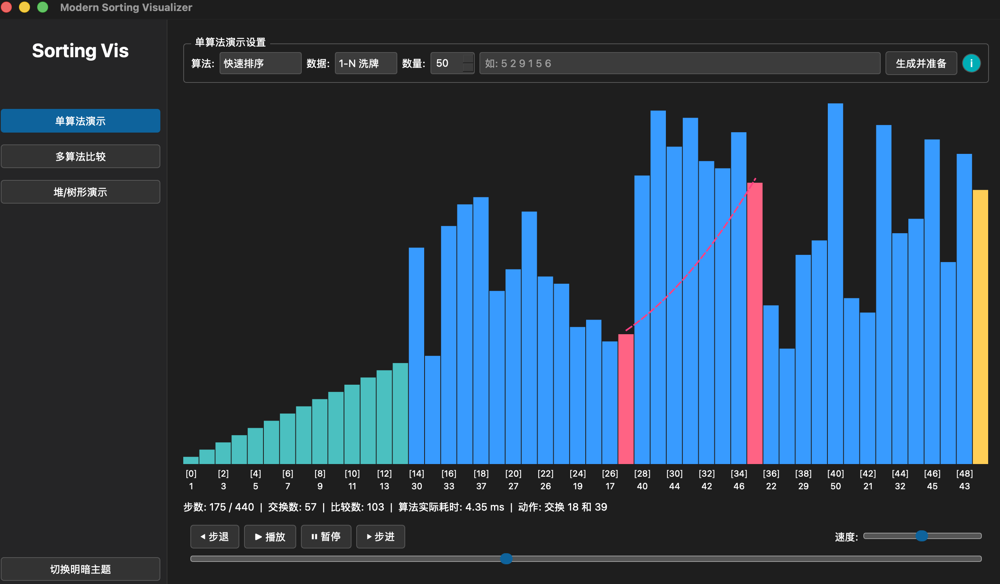

# MySortVisualization (数据结构可视化作业项目)

本项目是曾经本人学习 C++ 和 Qt 框架时的一个练习项目，原本由我与其他 3 位同学共同编写。当时由于本人对计算机体系结构了解非常少，实现的非常原始，低效且充满错误。本仓库是对原项目进行了完全重构后的版本，几乎已经看不出原本的痕迹了，放在了 HISTORY 文件夹下。此仓库仅作留档使用。



## 目录结构 (Directory Structure)

```text
.
├── CMakeLists.txt              # CMake 构建配置
├── README.md                   # 本说明文档
├── build/                      # 编译生成目录 (执行 cmake 生效后所在)
├── compile_commands.json       # clangd Linter 依赖的编译指令数据库链接
├── include/                    # C++ 头文件目录 (.h)
│   ├── MainWindow.h            # 主界面模块，把控侧边栏和深浅色主题
│   ├── PageCompareSort.h       # 【功能页】多算法并发比较视图
│   ├── PageSingleSort.h        # 【功能页】单算法测试视图
│   ├── PageTreeSort.h          # 【功能页】堆排序树形结构视图
│   ├── SortAlgorithm.h         #  排序算法实现及解析核心
│   ├── SortState.h             #  状态数据结构定义
│   └── VisualizerWidget.h      #  核心绘图画布件，负责 QPainter 画图
└── src/                        # C++ 源文件目录 (.cpp)
    ├── MainWindow.cpp          
    ├── PageCompareSort.cpp     
    ├── PageSingleSort.cpp      
    ├── PageTreeSort.cpp        
    ├── SortAlgorithm.cpp       # 包含了 9 种常见排序算法的具体生成逻辑
    ├── VisualizerWidget.cpp    # 具体的绘图执行过程实现
    └── main.cpp                # 程序的入口点
```

## 支持演示的算法
1. 直接插入排序 (Insertion Sort)
2. 折半插入排序 (Binary Insertion Sort)
3. 希尔排序 (Shell Sort)
4. 冒泡排序 (Bubble Sort)
5. 快速排序 (Quick Sort)
6. 直接选择排序 (Selection Sort)
7. 堆排序 (Heap Sort)
8. 归并排序 (Merge Sort)
9. 基数排序 (Radix Sort)

## 编译与运行 (Build & Run)

### 依赖环境
- C++ 17 及以上标准的编译器 (GCC, Clang, 或 MSVC)
- CMake 3.16 及以上版本。
- **Qt 5** (Core, Gui, Widgets 模块)

### 编译与运行指南 (跨平台)

请确保你在**项目根目录**里打开终端操作。为了避免复制粘贴时由于注释符导致终端报错（比如 `zsh: command not found: #`），下面的代码块去除了多余的注释，纯文字可以直接全选粘贴运行：

#### 🟢 macOS / Linux 平台

```bash
mkdir build
cd build
cmake .. -DCMAKE_EXPORT_COMPILE_COMMANDS=ON
cmake --build . -j 4
ln -sf $(pwd)/compile_commands.json ../compile_commands.json
./SortingVisualizer
```
*(注：`cmake --build . -j 4` 中的 `4` 表示使用4核心并行编译，你可以根据自己电脑的核心数修改。由于跨平台的稳定性，这里使用了 cmake 自带的 build 命令替代原先的 make。)*

#### 🔵 Windows 平台 (使用 MSVC, MinGW 或 Ninja)

在 Windows 平台上，推荐在 Developer Command Prompt (VS的开发者终端) 或者 PowerShell 中执行：

```powershell
mkdir build
cd build
cmake ..
cmake --build . -j 4
.\SortingVisualizer.exe
```
*(注：若是 MSVC 编译器，可执行文件可能生成在 `Debug\SortingVisualizer.exe` 中)*

### 完全清理构建 (Make Clean)

由于现代 CMake 推荐使用外部出树构建 (Out-of-source build)，我们所有编译产生的文件都在 `build` 文件夹中。所以最彻底、最安全的 `make clean` 方式就是直接**删掉整个 build 文件夹**然后重新进行编译：

* **macOS / Linux 清理指令**:
```bash
cd ..
rm -rf build
```

* **Windows 清理指令 (CMD)**:
```cmd
cd ..
rmdir /s /q build
```
